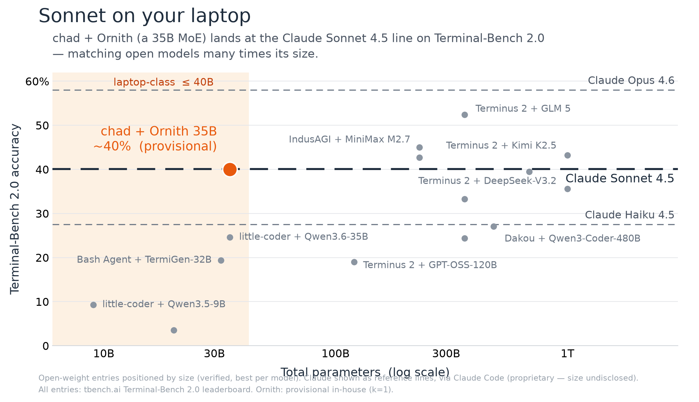

# chad — a local, MLX-backed coding agent

[](https://github.com/nathansutton/chad/actions/workflows/tests.yml)



> Claude can do anything, for anyone, anywhere. chad does one thing. 🗿
> *Coding under supervision.*

A single-user coding agent that runs **entirely locally on Apple Silicon** via
[MLX](https://github.com/ml-explore/mlx). Claude-Code-style tool use (bash, read, write,
edit, glob, grep), plan mode, and a full-screen TUI — driven by a local model on your
laptop instead of a frontier model in a datacenter. No Docker, no API key, no model picker.

## Quickstart

Apple Silicon Mac + [uv](https://docs.astral.sh/uv/). One command — no clone, no config:

```bash
uvx chad-code          # runs chad anywhere — the command is still `chad`
uvx chad-code prove    # 2-min offline smoke test: 4 tiny fix-it tasks, verified, timed 🗿
```

First run picks the right Ornith model for your RAM (9B under 32 GB, 35B at 32 GB+), asks,
and downloads it once (~5 GB / ~13 GB, resumable) into the shared Hugging Face cache. While
it downloads, `cd` into a project and think of a scoped first ask — *"fix the failing test
in `tests/test_x.py`"* lands; *"improve my codebase"* flails.

> The PyPI package is **`chad-code`**; bare `chad` is an unrelated squatted package. Other
> ways in (PATH install, bleeding-edge `main`, dev clone) are in
> [Installing & upgrading](#installing--upgrading).

## chad is not a baby Claude

He has some of the same moves — tool use, plan mode, a real TUI — but he's a blunter
instrument:

|                 | **Claude**                                      | **chad** 🗿                     |
|-----------------|-------------------------------------------------|---------------------------------|
| **Range**       | every workflow, every person, incredible nuance | one job: code, on your machine  |
| **Runs**        | anywhere — cloud, IDE, terminal, phone          | your mac. that's it.            |
| **Brain**       | a frontier model in a datacenter                | Ornith model                    |
| **Disposition** | understands what you *meant*                    | does what you *said*            |
| **Harness**     | open-ended, anything you can imagine            | plan. execute. nothing else.    |
| **When wrong**  | reasons a way out                               | already shipped                 |


> Real session, unedited (cold model load cut): a local 35B reasons through the failure,
> edits the file, reruns the tests, confirms green.

## Sonnet on your laptop

The exam is [Terminal-Bench](https://www.tbench.ai/leaderboard), the standard benchmark for
CLI coding agents. chad won't top it — the A students are frontier models in datacenters.
The number worth looking at is **how much capability chad wrings out of 35B parameters**:
on Terminal-Bench 2.1, chad + Ornith lands around the **Claude Sonnet 4.5** line, matching
open models many times its size and beating every open model in its own weight class by a
wide margin. On a laptop, *capability per parameter* is the axis you actually compete on —
and that's where chad + Ornith is out on the frontier alone.

> **Placeholder number** — the full verified run is still in flight (`≈50%`, k=1). The whole
> benchmark is **publicly reproducible from a Mac**: the exact Harbor adapter, the runner,
> and the recipe live in [`benchmarks/tb2/`](benchmarks/tb2/README.md). Check it, don't
> trust it.

## The bet: at this end of the report card, the harness beats the model

Every serious coding harness was built for a frontier model behind a datacenter API — which
bakes in two assumptions that are both false on a laptop: the model is an A student, and
prefill is somebody else's electricity. A C+ student emits tool calls with typos, quotes
edits it never applies, and rambles — and every token of transcript it drags around must be
re-read by *your* GPU at a few hundred tokens a second.

So chad's thesis isn't "run a model locally" — plenty of tools do that. It's that **for a
small model, harness quality is worth more than a model upgrade**, and the harness and
inference engine have to be designed *together*. The failure modes are all nameable: the
model pours its edit into the reasoning channel and the harness drops it; asks for a tool
the harness doesn't ship; balloons the context until cache reuse hits 0% and decode falls to
2 tok/s. chad handles each *inside* the harness — tool calls parsed in four dialects and
repaired, arguments schema-coerced with a self-repair loop, edits run through a forgiveness
cascade, and above all the transcript kept a **strict token-prefix of the live KV cache** so
prefill never re-reads what it already read. That co-design is the whole moat. The full
story is in [Design & internals](docs/design.md).

## Installing & upgrading

The one-line quickstart (`uvx chad-code`) is up top. The other ways in:

```bash
uv tool install chad-code   # install for good — then it's just `chad`
uvx --from git+https://github.com/nathansutton/chad chad   # bleeding-edge main, no clone
```

Or from a clone (the dev path):

```bash
uv sync                      # install deps + the `chad` entrypoint (one time)
uv run chad                  # full-screen TUI
uv run chad "add a --json flag to main.py and update the tests"   # one-shot, headless
uv run chad -c               # resume this directory's last conversation
```

**The model.** chad picks one for you by RAM and downloads it once into the shared Hugging
Face cache (`~/.cache/huggingface`, reused across every project). No picker, no flags —
override with `CHAD_MODEL=<repo or local dir>` if you must.

| Your Mac | Model | Footprint |
|---|---|---|
| **≥ 32 GB** | [Ornith-1.0-35B `UD-Q2_K_XL`](https://huggingface.co/nathansutton/Ornith-1.0-35B-UD-Q2_K_XL-MLX) — 35B MoE, 2-bit experts | ~13 GB resident (~16 GB with KV) |
| **16 / 18 / 24 GB** | [Ornith-1.0-9B `UD-Q4_K_XL`](https://huggingface.co/nathansutton/Ornith-1.0-9B-UD-Q4_K_XL-MLX) — 4-bit AWQ | ~5 GB |

The 35B's working set needs headroom a 24 GB Mac doesn't have (it SIGKILLs mid-turn), so its
floor is **32 GB**; 24 GB and below run the 9B. Quant names follow
[Unsloth's dynamic-quant convention](https://docs.unsloth.ai/) (`UD-…`).

**Upgrading** — depends on how you installed: `uv tool upgrade chad-code`; `uvx --refresh
chad-code`; or `git pull && uv sync` for a clone. What changed lands in
[`CHANGELOG.md`](CHANGELOG.md). Model weights are versioned separately — a code upgrade never
re-downloads the model.

**Development.** `uv sync` once, then `uv run pytest -q` — the fast unit gate loads **no
model weights**, runs in seconds, and is what CI runs. Throughput on your own machine:
`uv run chad-bench` (see [Throughput & performance](docs/benchmarks.md)). LSP-precise
find-references / rename need the `lsp` extra (`uv tool install 'chad-code[lsp]'`); without
it chad uses the tree-sitter fallback automatically.

## Interactive UX

`uv run chad` launches a full-screen terminal UI (built on prompt_toolkit):

- **shift-tab cycles permission modes** — `normal` (confirm each bash/write/edit) →
  `auto-accept edits` → `plan mode` (read-only: investigate + propose a numbered plan) → back.
- **type-ahead message queue** — keep typing while the agent works; messages run in order.
- **ctrl-c interrupts the running turn** without killing the session.
- **live status line** — model, mode, context %, a state glyph + verb, elapsed seconds, and
  **↑prefilled / ↓generated** token counts (with an advancing **%** on an unavoidable full
  re-prefill, so it's never silent).
- **slash commands** — `/init`, `/skills`, `/mcp`, `/accept`, `/resume`, `/compact`,
  `/model`, `/mode`, `/help`, `/exit`. Same set in the `--repl` line interface.
- **`@file` / `@dir` mentions** and **`!command` shell passthrough** — pull a file into
  context inline, or run a shell command without invoking the model.

**Usage.** `uv run chad --help` is the source of truth:

| Flag | What it does |
|---|---|
| `-c, --continue` | resume this directory's **most recent** session (non-destructive) |
| `--resume` | list recent sessions, pick one by number (interactive TTY only) |
| `--plan` | start in read-only plan mode (investigate + propose, edits blocked) |
| `--yolo` | auto-approve bash/write/edit (skip confirm prompts) |
| `--no-think` | skip Ornith's `<think>` blocks — faster on well-scoped work |
| `--repl` | plain line REPL instead of the TUI |

A headless task (positional, or piped with no TTY) auto-approves mutating tools; the model
runs greedy (temp 0). Every conversation is persisted under `~/.chad/sessions/`, and every
resume forks a new branch rather than overwriting — details in
[Configuration](docs/configuration.md#sessions). The rarely-touched tuning knobs
(`CHAD_MAX_CONTEXT`, `CHAD_KV_BITS`, turn-budget/think-cap, safety opt-outs) all live in
environment variables, fully documented there.

## Extending chad

chad speaks the same two extension formats as Claude Code:

- **[Agent Skills](https://agentskills.io)** — drop a `SKILL.md` folder in `./.claude/skills/`
  and chad discovers it, loading the full instructions only when a task matches.
- **[MCP servers](https://modelcontextprotocol.io)** — configure stdio or HTTP servers in
  `./.mcp.json` to expose external tools (GitHub, Postgres, Linear, Slack, …) alongside
  chad's builtins, with static-token and OAuth auth.

Both are covered in full in the [Configuration reference](docs/configuration.md).

## Documentation

- **[Design & internals](docs/design.md)** — why prefill is the bill, the persistent prefix
  cache, the trimmable/append-only trade, and the ideas borrowed from other agents.
- **[Throughput & performance](docs/benchmarks.md)** — prefill / decode / warm-step numbers
  you can reproduce with `chad-bench`.
- **[Terminal-Bench 2.0 reproduction](benchmarks/tb2/README.md)** — the exact Harbor adapter
  and runner behind the chart; serve Ornith yourself and check the number.
- **[Configuration reference](docs/configuration.md)** — Agent Skills, MCP servers, the
  context window, every environment variable, and the safety opt-outs.
- **[Troubleshooting](docs/troubleshooting.md)** — when a session rambles, loops, or slows:
  the symptom→knob map for a small local model.
- **[Contributing](CONTRIBUTING.md)** — what lands easily, and what needs a conversation first.
