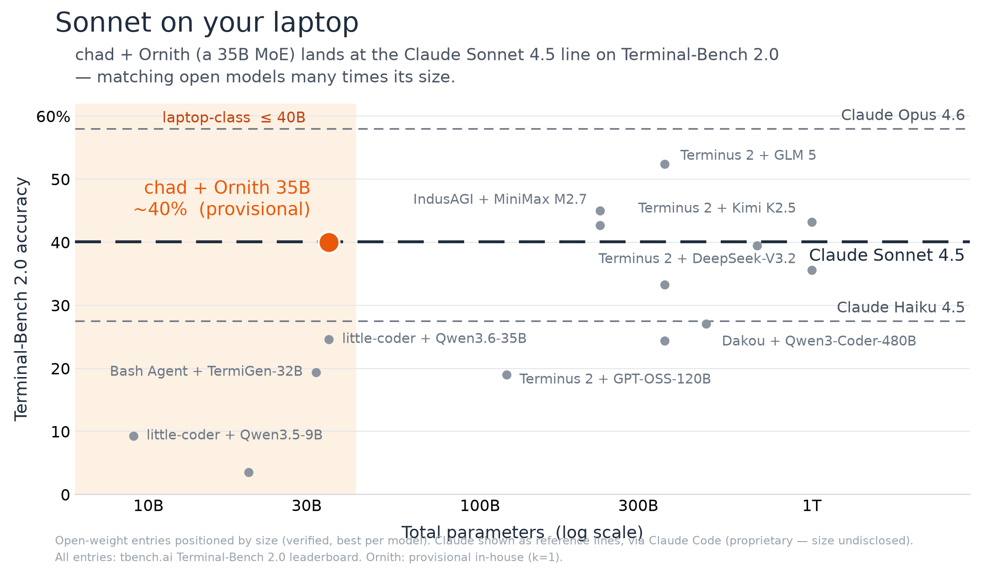

# Throughput & performance

*The numbers that decide whether a local agent feels responsive — prefill speed, decode
speed, and the per-step cost once the cache is warm. All of them are reproducible on your
own Mac with `chad-bench`. Task pass-rates (Terminal-Bench 2.1) are reproducible too —
they have their own kit in [`benchmarks/tb2/`](../benchmarks/tb2/README.md). For the
engineering behind them, see [Design & internals](design.md).*

## Reproduce it yourself

```bash
uv run chad-bench                       # default: 5000-token prefill, 128-token decode
uv run chad-bench --prefill-tokens 8000 --gen-tokens 256
uv run chad-bench --chunk 1024          # force a prefill chunk size (overrides CHAD_PREFILL_CHUNK)
uv run chad-bench --agentic             # the cache-miss benchmark, below
```

It drives the **real** `Engine` on the **real** model (`src/chad/bench.py`) and reports
three things:

1. **Prefill (cold)** — how fast the model reads a fresh prompt. The bill a naive agentic
   loop pays *every step*.
2. **Decode** — how fast it writes new tokens. Memory-bandwidth bound, roughly constant.
3. **Warm step** — the agentic-loop number: how few tokens a *follow-up* turn has to
   prefill once the persistent prefix cache is warm. This is the whole point.

## Measured throughput (M4 Pro, 24 GB)

Measured with `chad-bench` (5,000-token cold prompt, 128-token decode, a follow-up turn
that appends ~16 tokens):

| Model | Prefill (cold) | Decode | Warm-step prefill |
|---|---|---|---|
| **Qwen3.8-27B** `UD-Q3_K_XL-DFlash2` (shipped) | ~99 tok/s | ~20.3 tok/s | ~0.75 s (16 tok) |

> Measured on this machine with the command above; run it on yours — these are hardware
> numbers, not scores. Figures for the models 1.x shipped are archived under
> [Before 2.0.0](#before-200-the-ornith-tier), and are not comparable: a sparse MoE
> activating ~3B params/token and a dense 27B are different animals.

Prefill is the honest cost of a dense checkpoint: every one of the 27B parameters is read
for every token of the prompt, so ~99 tok/s is close to this chip's compute roofline rather
than a tuning failure. It is also why the [warm prefix
cache](#the-second-session-in-a-project-starts-warm) matters more than any decode work — the
third column, not the first, is what a session actually pays after its first turn.

The decode figure is steady-state single-token decode. It does not capture the speculative
plateau: `chad-bench` writes 128 tokens from a cold 5,000-token prompt, and the adaptive
draft schedule only opens its deep widths behind a full-accept streak, so a short run
mostly measures the shallow regime. Long generations at long context — the ones that
dominate an agent session — do reach it.

`--agentic` measures a different thing and is worth knowing about: it seeds a large context
(`--context-tokens`, default 24,000) and reproduces the **truncated-turn cache miss** — the
case where a step ends mid-`<think>` and the next step's prompt is no longer an extension of
the cache — reporting the re-prefill that step pays with and without the fix. The other three
numbers tell you how fast the happy path is; this one tells you what an unhappy one costs.

Two things hold whatever the model. Prefill rate **falls as context grows** (attention is
quadratic), so a cold-prompt number measured at 5,000 tokens is materially lower by 32k.
Decode is the opposite: nearly flat, and it is what the long-context tuning defends. The
warm-step number is the one that decides how the agent *feels*, and it is a property of the
persistent prefix cache rather than of the weights — a follow-up turn prefills the ~16
tokens it appended, not the whole transcript.

Qwen3.8-27B is **dense**: every parameter is read on every token, with no sparse routing to
hide behind. That is why the quant is aggressive — on a dense model, shrinking the weights is
the only decode lever there is, which is also [why decode sits where it
does](#why-decode-sits-where-it-does).

## The agentic-loop win: ~0.75 s per step, not ~50 s

The headline isn't the cold-prefill rate — it's what a *follow-up* turn costs. On the
shipped model a 5,000-token transcript prefills cold in **~50 s**. But the next agentic step
only appends the model's reply, a tool call, and the tool's output, so with the persistent
prefix cache it re-reads **nothing**: the follow-up turn prefills just the ~16 appended
tokens in **~0.75 s**.

```
cache-less backend:  re-prefill all 5,143 tokens  ->  ~50 s of dead air, every step
chad (prefix cache): prefill the 16 new tokens     ->  ~0.75 s, every step
```

That ~67× gap is the entire reason a local model can feel like an agent instead of a batch
job — and it widens with the transcript, since the cache-less side grows while the warm step
stays flat. Note which side of the trade the slow cold prefill lands on: it is paid once per
divergence, and the cache is what makes it once. Why that cache is *append-only* (and why
that's the right trade for a hybrid SSM/attention model) is in
[the cache trade](design.md#trimmable-vs-append-only-the-cache-trade-chad-lives-with).

## The second session in a project starts warm

The ~0.75 s figure above is the *within*-session win. Across sessions there is a second one,
and it is larger: chad checkpoints the stable system+tools KV prefix to disk
(`engine.warm_prefix`) and reloads it when you next start in the same project, so the
~2.8k-token system+tools prefix is prefilled **once, ever** rather than once per session.
(That prefix is the byte-identical head of every turn — the behavioral prompt, the
workspace snapshot, and the five tool schemas. It grew no skills catalog in 2.0.0, which
is most of why it is ~2.8k and not the ~8k a tier-1 disclosure would cost; see
[Agent Skills](configuration.md#agent-skills-agentskillsio).)

Measured on the shipped 27B (M4 Pro, 24 GB), one fixture and one ask, cold vs. warm:

| | cold (first session in a project) | warm (checkpoint hit) |
|---|---|---|
| ask → first tool call | 75.6 s | **5.5 s** |
| whole turn | ~103 s | **31.4 s** |

The cold column is a real cost and worth stating plainly: the first turn in a *new* project
spends over a minute reading a system prompt before it does anything you asked for. It is
also a cost you pay once — the checkpoint is keyed on the whole system prompt, cwd and repo
map included, so it survives restarts and is invalidated exactly when the prompt it caches
actually changes. The session banner's `[warm start: N prefix tokens from disk cache]` line
is chad telling you which of these two turns you are about to have.

## Why decode sits where it does

The first-order answer is memory bandwidth: each token streams the resident weights through
the chip once, so `tok/s ≈ bandwidth / resident-bytes-per-token`. On a **dense** model that
story is largely right, and it is why the quant is as aggressive as it is — every parameter
is read for every token, so shrinking the weights is the only decode lever there is. ~12 GB
against this M4 Pro's ~273 GB/s is the envelope the engine works inside, and no amount of
kernel work moves that wall.

Inside the envelope, two things decide how close you get. Both were first measured on the
retired 35B, whose sparse MoE made them unmissable; the *lessons* are what carried into
2.0.0, and the code that serves them was rebuilt for the dense checkpoint.

- **Dispatch cost is real, and work that removes kernels pays.** In-situ ablation of the
  35B's decode step put bandwidth-minimal cost around 9 ms against ~14 ms real: the step
  issued roughly **400 Metal kernels per token**, each carrying ~9 µs of launch and gap
  latency. A step that is waiting on the command queue does not care how few bytes you
  read. chad's decode fast-path
  ([`mlx_fastpath.py`](../src/chad/mlx_fastpath.py)) attacks the kernel count directly: on
  the shipped model it concatenates each layer's MLP `gate|up` pair and the GatedDeltaNet's
  four same-input `in_proj` tensors into single `quantized_matmul`s, then compiles the whole
  S=1 layer step — MLP block and GDN forward each one call, layernorms and residuals folded
  in. Row-wise math is unchanged and greedy token choices were verified identical to stock.
  Prefill deliberately keeps the stock op graph: the compiled kernels change bf16 rounding,
  and on a recurrent hybrid a prefill-side rounding change compounds across the whole
  transcript. `CHAD_NO_FASTPATH=1` is the A/B arm.
- **Attention is a reuse problem, not a fetch problem.** Ablating the math out of the fused
  quantized-KV kernel leaves it streaming at ~331 GB/s — already at this machine's measured
  roofline — with ~68% of its runtime spent on the GQA q-heads re-reading staged K/V out of
  threadgroup memory. That is why [`mlx_qsdpa.py`](../src/chad/mlx_qsdpa.py) has a
  `simdgroup_matrix` schedule giving each simdgroup its own position-stream instead of its
  own head. This is the part of the kernel work that survived the model change intact — the
  same kernel serves the shipped model, and 2.0.0 *added* a multi-token (S>1) tier to it so
  speculative verification and prefill get the fused path too, worth 8% at 8k context and
  30% at 38k over the dequantize-the-whole-cache fallback at the widths the draft schedule
  actually jumps to.

The honest caveat, and the reason every number on this page is end-to-end rather than
per-kernel: **isolated kernel speedups oversell badly.** The attention retile measured
1.26–1.40× *on the kernel* and moved the whole decode step ~2%, because attention is only a
fifth of it. Trust steady-state `chad-bench` tok/s; don't extrapolate from a microbenchmark. 🗿

You don't have to tune any of this. chad picks the fast configuration at startup — the
KV-cache bit width, the fused-attention schedule (which of its kernels runs, up to what
verify width, and the split factor, which widens past 16k context except for the one kernel
whose partials slab makes that a loss), and the speculative draft depth are all chosen from
measurements and applied for you. MLX's own runtime knobs are deliberately left alone:
`MLX_METAL_FAST_SYNCH` and the command-buffer size limits were swept and every setting was
*slower* than mlx's defaults, so chad overrides none of them. `chad-bench` reports what
you're getting.

## The model: Qwen3.8-27B

chad runs **one** model — [`Qwen3.8-27B UD-Q3_K_XL-DFlash2`](https://huggingface.co/nathansutton/Qwen3.8-27B-UD-Q3_K_XL-DFlash2-MLX),
a dense `qwen3_5` hybrid (64 layers: 48 GatedDeltaNet + 16 full attention) quantized to
3-bit group-64 with `lm_head` held at 5-bit, ~12 GB resident, 262k native context. One
model, every machine — no RAM-aware pick, no size tier, no flag. chad targets 24 GB Macs and
nothing smaller. The vision tower is not present at all (it was dropped at conversion time;
mlx-lm's `qwen3_5` loader would have discarded it at load anyway).

It's a *thinking* model that emits tool calls in the XML `<function=…>` dialect — the
harness parses both that and JSON, and strips `<think>` blocks. The repo also carries the
**DFlash2 block drafter** it decodes with, pre-quantized in `dflash/`; see
[speculative decoding](configuration.md#speculative-decoding--kernel-knobs). One fast, good
model per machine beats a menu of mediocre ones, so there are no model flags to pick from —
you just run `chad`.

## Two throughput levers

**Thinking budget.** This is a reasoning model, and its `<think>` blocks dominate what it
generates — measured on real agentic traces, **~62–66% of all generated tokens**. Because decode runs at a roughly fixed tok/s whatever it is writing,
those tokens are pure wall-clock. `--no-think` (a per-turn toggle, or the flag) injects an empty think block
and skips them — the most effective time-to-done lever on well-scoped agentic work. Thinking
stays **on** by default, since it helps on harder reasoning; flip it off when the task is
well-specified and you'd rather not wait on the reasoning tokens.

**Speculative decoding.** chad drafts with a DFlash2 block drafter — a 1.9B model that reads
the main model's residual stream at five layers and proposes a block of tokens in one forward —
and verifies in one batched main-model forward, accepting by exact rejection sampling: every
emitted token is the model's own choice, sampled output keeps its true distribution, and greedy
output matches plain decoding to kernel rounding (it follows serial until the first near-tie —
the batched verify and the serial step run different kernels). Measured on
an M4 Pro with the shipped quant (one load, same prompts, 384-token decodes):

| sampling | serial | **DFlash2** |
|---|---|---|
| greedy | 17.5 tok/s | **60.1 (3.4×)** |
| thinking preset (temp 1.0, top_p 0.95, top_k 20 — the default) | 22.4 | **49–51** |
| non-thinking preset (temp 0.7, top_p 0.80, top_k 20) | 23.7 | **52–54** |

Ten prompts (eight ~512-token prose seeds, two code continuations), 384-token decodes, medians,
one load per run, on a 3-bit g64 quant of the same model. On prose the drafter lands ~8 tokens
per round; code runs ~44 tok/s greedy. Those seeds are public-domain text the model has
memorized, so they show the ceiling. **On real traffic** — `benchmarks/spec_decode.py`, ten
mid-session contexts of 12–19k tokens replayed out of `~/.chad/sessions` with their tool results
and schemas, 384-token decodes — acceptance inside `<think>` is 35–55% and the numbers are:

| sampling (real contexts) | serial | schedule (default) | fixed full block |
|---|---|---|---|
| greedy — median / floor | 14.8 / 13.2 | **31.7** / **21.4** | 36.0 / 17.5 |
| thinking preset — median / floor | 13.9 / 13.1 | **27.6** / **17.7** | 27.1 / 15.7 |

The per-round width schedule is the default because of the floor column: a full-block round
costs ~2.2 serial steps whatever it commits, so on the worst prompt a fixed block drops to
17.5 tok/s (and to 11.7, below serial, on a repo-text seed at the thinking preset) while the
schedule narrows and never measured under serial. `CHAD_DFLASH_ADAPTIVE=0` is the fixed arm. Two pieces make that number: the block drafter's
acceptance, and the small-M matmul kernel (`mlx_qmm_mma.py`) that makes an 8-row verify cost
what a 5-row one does — a full-block round is 2.2 serial steps, flat from width 4 up. Without
the kernel each extra verify row costs ~33 ms and the drafter's optimum is width 4 at 28 tok/s;
with its first, threadgroup-staged version the round cost 3.2 steps (47.7 / 41.4). The wall
now is the chip's MMA issue rate, not memory. `CHAD_NO_DFLASH=1` turns speculation off
entirely and decodes one token per forward — the `serial` column.

Prompt-lookup decoding (PLD) — the draft-model-free variant that proposes continuations from
n-grams already in context — is implemented and greedy-exact, but is **opt-in** (`CHAD_USE_PLD=1`)
rather than default. It drafts from context *recurrence*, and on real agentic traces that is a
minority of what this agent writes: whole-session contribution measured at **+2.2%** of
generated tokens. It also doesn't compose with block speculation (one generate loop each), so
where the drafter is available it is strictly the better of the two.

---

## Task pass-rates: Terminal-Bench 2.1 (reproducible)

Capability is measured on [Terminal-Bench 2.1](https://www.tbench.ai/leaderboard), and the
whole run is reproducible **from a Mac**: the exact Harbor agent adapter, the runner script,
and the serving recipe live in [`benchmarks/tb2/`](../benchmarks/tb2/README.md). chad is
installed *into* each task container — TB2 verifies a task by the container's end state — so
generation has to be remote: the in-container chad runs `--backend llama` against a server
you provide. Serve this Mac's own weights with
[`chad serve`](configuration.md#serving-the-local-model-to-a-container-chad-serve), or a GGUF
with `llama-server` from a box that can hold them. Not `mlx_lm.server`: it strips the
`<think>` block, which makes it unusable for a reasoning model.

**The 2.0.0 default has not been scored yet, and this page will not guess.** Changing the
default model invalidates the score measured on the old one, and chad's release rule is that
a benchmark claim flips in its own dedicated commit once the run lands — never bundled into
the release that changed the thing being measured. So 2.0.0 ships with no pass-rate claim,
and the only scored number on this page is [archived under the model that earned
it](#before-200-the-ornith-tier).

Mind the kit's standing caveat when you run it: TB2 pass-rate is **throughput-sensitive**.
Tasks carry wall-clock budgets, so your serving speed is part of the score, and a slow host
can fail a task on time rather than on capability.

### Before 2.0.0: the Ornith tier

Archived, not claimed. Through 1.x chad shipped **two** models and picked between them by
RAM — Ornith-1.0-35B on a 24 GB box, Ornith-1.0-9B on 16/18 GB. 2.0.0 retired both for a
single dense 27B and made 24 GB the floor. **Nothing in this section describes what you get
from chad today**; it is kept because the 57% below is a published number and a published
number should stay checkable.



| Measured | Model | Score | Conditions |
|---|---|---|---|
| chad 1.x, 2026 | Ornith-1.0-35B `UD-Q2_K_XL` | **57%** (51/89) | k=1, self-run, **not leaderboard-verified** |

The comparison the chart makes is the durable part, and it is why chad exists: every
*verified* entry on the TB 2.1 board is a proprietary frontier model in a datacenter, scoring
59–84% and spending $130–$2,000 in API fees per run. That result sat at 57% for the
electricity. The axis is capability per dollar. The *point* survives the model change; the
number does not travel with it, which is why it lives here instead of on the front page.

Throughput for the retired pair, measured with `chad-bench` on an M4 Pro (5,000-token cold
prompt, 128-token decode, a follow-up turn appending ~16 tokens):

| Model | Macs | Prefill (cold) | Decode | Warm-step prefill |
|---|---|---|---|---|
| Ornith-1.0-35B (2-bit MoE) | ≥ 24 GB | ~730 tok/s | ~74 tok/s | ~0.2 s (16 tok) |
| Ornith-1.0-9B (4-bit dense) | 16 / 18 GB | ~360 tok/s | ~46 tok/s | ~0.25 s (16 tok) |

Read those columns against the 27B's with care rather than as a regression. The 35B MoE
activated only ~3B params per token — which is why it both prefilled ~7× faster and decoded
~1.6× faster than the 9B dense model despite four times the parameters — and sparsity is
exactly what 2.0.0 gave up. What it bought is on the [capability](#task-pass-rates-terminal-bench-21-reproducible)
side of the ledger, and the warm-step column, the one a session actually pays, barely moved.


---

*Day-to-day correctness is additionally tracked in a private eval suite (it seeds repos,
runs the agent, and verifies the actual edit). This page stays focused on the numbers you
can reproduce yourself: throughput via `chad-bench`, pass-rates via `benchmarks/tb2/`.*
